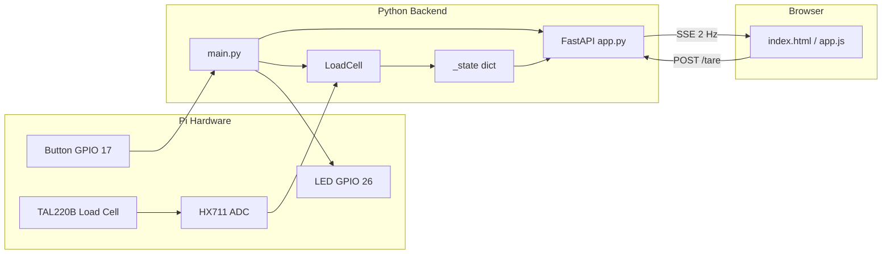
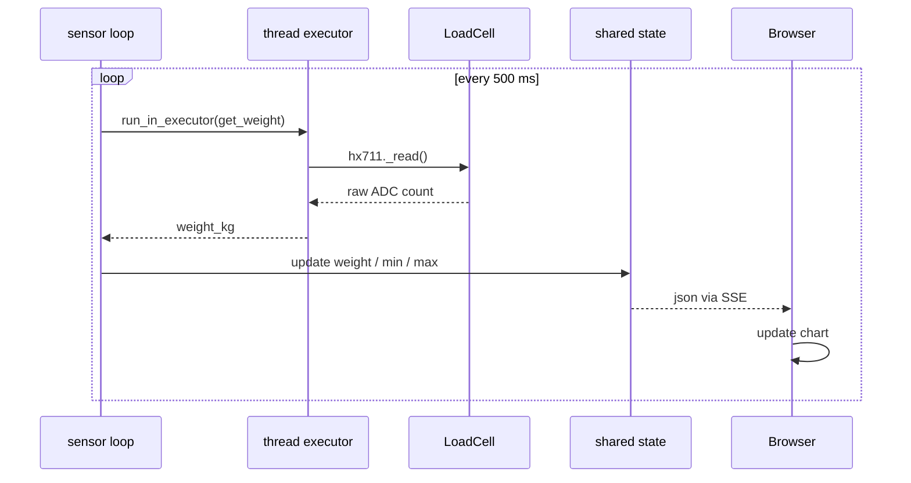
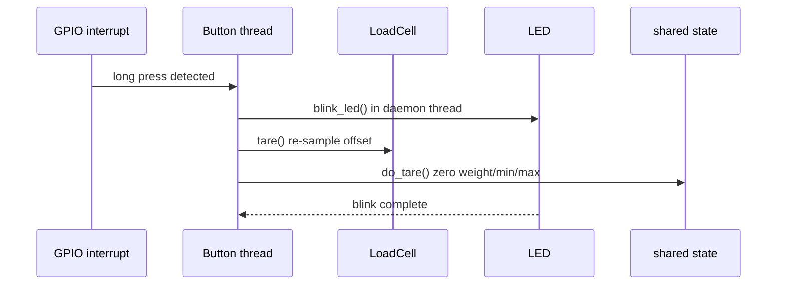
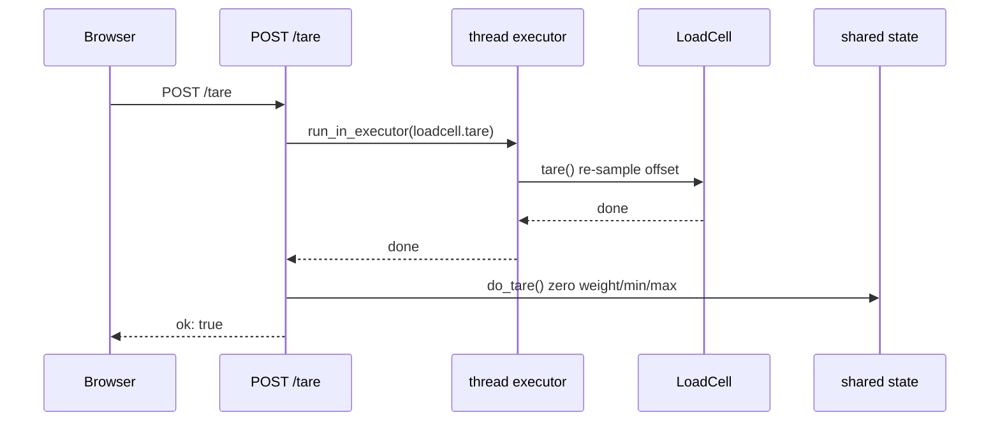
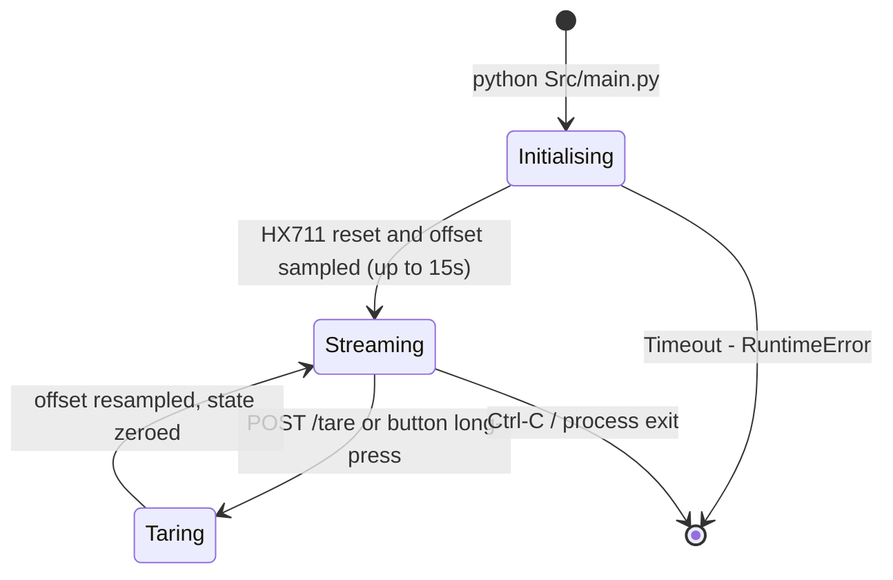

# AnkleFlex — Architecture

> **Status:** Current — April 2026 · Branch: `develop`

See also: [docs/REQUIREMENTS.md](docs/REQUIREMENTS.md) · [docs/CONTRIBUTING.md](docs/CONTRIBUTING.md) · [TECHSPEC.md](TECHSPEC.md)

---

## What This Project Does

AnkleFlex is a portable biofeedback device for ankle rehabilitation. A Raspberry Pi 4B reads force data from a TAL220B load cell (via HX711 ADC) and streams it in real time to a browser-based dashboard. There is no screen on the device — everything is viewed through a browser on a clinician's laptop or patient tablet.

The Pi runs a WiFi hotspot (`AnkleFlex` / `starseng`). Any device that connects to it can open `http://ankleflex.local:8000/` and immediately see a live force chart. The clinician can tare (zero) the sensor either via a physical button on the device or the on-screen button. A long LED blink confirms a tare has happened.

The same application runs on a developer's Windows or macOS laptop in *emulation mode* (set `ANKLEFLEX_EMULATE_LOADCELL=1`). An on-screen slider replaces the physical load cell, so the full UI and API can be developed and tested without any hardware.

---

## Architecture Overview

The application has three layers: hardware peripherals, a Python backend, and a browser frontend. They communicate through a single shared state dictionary that the backend's sensor loop writes and SSE clients read.



The emulation path replaces `HX711 ADC` with `EmulatedHX711` (injected into `LoadCell` via constructor argument). Everything else — offset arithmetic, sensor loop, SSE, the browser UI — is identical.

---

## Key Data Flows

### 1. Live sensor reading → browser chart

The sensor loop runs as an asyncio background task for the lifetime of the server. Every 500 ms it offloads a blocking HX711 read to a thread, updates `_state`, and every connected SSE client picks up the new value on their next tick.



### 2. Tare — physical button

A daemon thread polls for GPIO mode changes. When the button is held > 1 s, it re-samples the HX711 offset (new zero reference) then calls back into `app.py` to reset the session min/max.



### 3. Tare — browser button

The browser path goes through the HTTP API. The hardware re-zero and the session stat reset happen in the same request handler.



---

## Module Guide

| File / Module | Responsibility | Notes |
|---|---|---|
| `Src/main.py` | Process entry point — reads env var, constructs objects, wires them, starts Uvicorn | The only place where hardware and emulation paths diverge |
| `Src/led.py` | LED on/off/blink — GPIO on Pi, no-op stubs in emulation | Module-level functions (no class); stubs selected at import time |
| `Src/hardware/loadcell.py` | HX711 reads, offset arithmetic, weight formula, tare | Accepts `hx711=` injection; GPIO imports deferred to `__init__` |
| `Src/hardware/button.py` | GPIO interrupt setup, long-press vs double-press gesture | Pi-only; GPIO imported inside `__init__` |
| `Src/emulation/hx711.py` | Drop-in ADC stub — converts a kg value to raw counts | Implements only `_read()` and `reset()`; the private interface LoadCell uses |
| `Src/server/app.py` | FastAPI app, all routes, background sensor loop, `_state` dict | Also exports `configure()` and `do_tare()` for `main.py` to call |
| `Src/server/static/app.js` | SSE client, Chart.js bar chart, tare + slider API calls | No server contact outside `fetch()` and `EventSource` |
| `Src/server/static/index.html` | Single-page UI shell | Emulation panel hidden by CSS until SSE says `emulation: true` |
| `Src/server/static/vendor/chart.min.js` | Vendored Chart.js 4.4.3 | Vendored because Pi has no internet at runtime |
| `pyproject.toml` | `uv`-managed dependencies; `hardware` extra for Pi-only packages | `hx711` pinned to `1.1.2.3` — private `_read()` is not stable |
| `setup.sh` | Pi deployment: installs `uv`, syncs `--extra hardware`, sets up crontab | Run once on a fresh Pi |

**Non-obvious boundary:** `do_tare()` (resets session min/max in `_state`) and `loadcell.tare()` (recalibrates the ADC zero reference) are separate functions that are always called together. The split means the ADC could theoretically be re-zeroed without resetting the session stats — useful if that feature is ever needed. The button calls both via its `on_tare` callback; the HTTP endpoint calls both in the same request handler.

---

## State & Lifecycle



In emulation mode, *Initialising* completes instantly (no hardware reset) and the *Taring* transition is also instant.

---

## Dependencies

| Package | Purpose | Why this one |
|---|---|---|
| `fastapi >=0.110.0` | HTTP framework + OpenAPI docs | Native async; first-class SSE; much lighter than Flask+Dash |
| `uvicorn[standard] >=0.29.0` | ASGI server | `uvloop` + `httptools` give good Pi performance; `[standard]` is required for these extras |
| `sse-starlette >=1.6.0` | `EventSourceResponse` helper | Handles SSE framing and client-disconnect; avoids hand-rolling chunked HTTP |
| `hx711 ==1.1.2.3` | HX711 ADC driver (Pi only) | Pinned — `LoadCell` calls `_read()` directly, a private API that changed between versions |
| `rpi-lgpio ==0.6` | GPIO backend (Pi only) | Drop-in replacement that supports both Pi 4 and Pi 5; `import RPi.GPIO` still works |

---

## Getting Started

### Emulation mode (no hardware required)

```powershell
# Windows / PowerShell
uv sync
$env:ANKLEFLEX_EMULATE_LOADCELL = "1"
python Src/main.py
```

```bash
# macOS / Linux
uv sync
export ANKLEFLEX_EMULATE_LOADCELL=1
python Src/main.py
```

Open `http://localhost:8000/` — an emulation slider appears at the bottom of the page to simulate load.

### Hardware mode (Raspberry Pi)

```bash
bash setup.sh   # first-time setup only
python Src/main.py
```

Connect a device to the `AnkleFlex` WiFi hotspot (password: `starseng`) and open `http://ankleflex.local:8000/`. Fallback IP: `http://10.42.0.1:8000/`.

### Where to start reading

1. **`Src/main.py`** — shows exactly how the application is assembled and which path (hardware vs emulation) is taken.
2. **`Src/server/app.py`** — the sensor loop and all API endpoints. This is the core of the runtime.
3. **`Src/hardware/loadcell.py`** — the weight formula and tare logic; understanding `CALIBRATION_FACTOR` (it's negative — see [TECHSPEC.md](TECHSPEC.md)) prevents a common confusion.
4. **`Src/server/static/app.js`** — the full browser-side logic is ~160 lines of vanilla JS.
