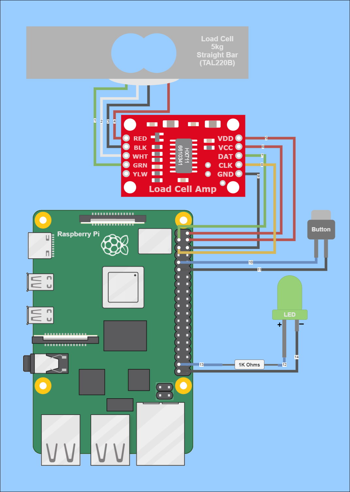
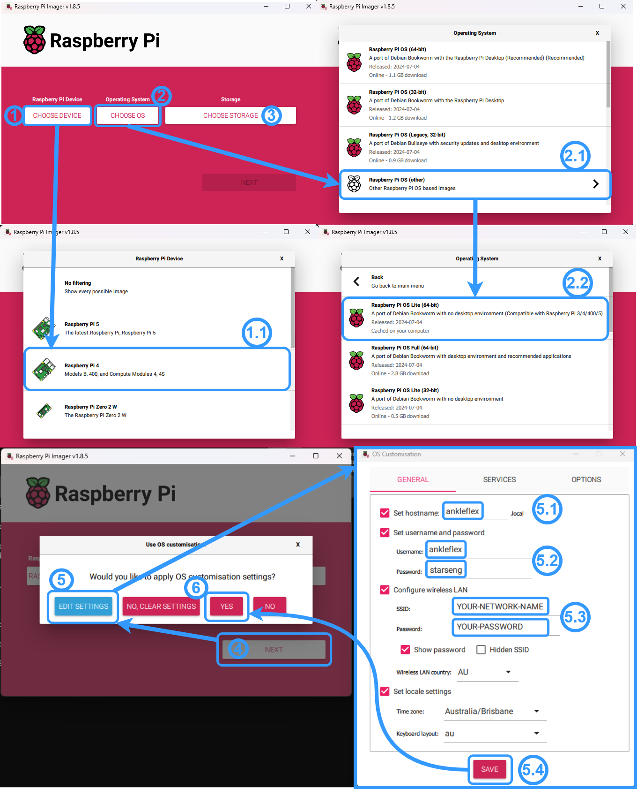

# README: Raspberry Pi Load Cell Project

## Project Overview

This project interfaces a Raspberry Pi with an HX711 load cell amplifier and a 5kg straight bar load cell (TAL220B) to measure weight. It also includes a button and an LED for interaction and indication purposes. The setup can be used for various applications such as digital scales, force measurement, or other load monitoring systems.


- [README: Raspberry Pi Load Cell Project](#readme-raspberry-pi-load-cell-project)
  - [Project Overview](#project-overview)
  - [Components Required](#components-required)
  - [Setup Process](#setup-process)
    - [Hardware Setup](#hardware-setup)
    - [Raspberry Pi set up](#raspberry-pi-set-up)


## Components Required

1. **Raspberry Pi** (Any model with GPIO pins)
2. **HX711 Load Cell Amplifier**
3. **5kg Straight Bar Load Cell (TAL220B)**
4. **Button**
5. **LED**
6. **1k Ohm Resistor**
7. **Jumper Wires**
8. **Breadboard or PCB for connections**


## Setup Process

### Hardware Setup

| Wire | Load Cell | HX711 | Raspberry Pi | Button | 1K Ohms Resistor | LED |
|------|-----------|-------|--------------|--------|------------------|-----|
| 1    | Green (A+) | Green (A+) |              |        |                  |     |
| 2    | White (A-) | White (A-) |              |        |                  |     |
| 3    | Black (E-) | Black (E-) |              |        |                  |     |
| 4    | Red (E+)   | Red (E+)   |              |        |                  |     |
| 5    |            | VDD   | 5V Power     |        |                  |     |
| 6    |            | VCC   | 5V Power     |        |                  |     |
| 7    |            | DAT   | GPIO 2 (SDA) Pin 3 |        |                  |     |
| 8    |            | CLK   | GPIO 3 (SCL) Pin 5 |        |                  |     |
| 9    |            | GND   | GND          |        |                  |     |
| 10   |            |       | GPIO 17 Pin 11 | Leg 1  |                  |     |
| 11   |            |       | GND          | Leg 2  |                  |     |
| 12   |            |       |              |        | Leg 1            | Positive Pin |
| 13   |            |       | GPIO 26 Pin 37 |        | Leg 2            |     |
| 14   |            |       | GND          |        |                  | Negative pin |

<!-- include Doc/wiring_diagram.png -->


### Raspberry Pi set up
First we need to flash the Raspberry Pi OS to a microSD card. We can use the Raspberry Pi Imager. Follow the steps in [this tutorial](https://projects.raspberrypi.org/en/projects/raspberry-pi-setting-up/2) to do this. 
**After clicking next and before clicking Yes**, make sure to set up the WiFi connection and change the hostname to `ankleFlex`, the username to `ankleflex`, and the password to `starseng`. This will make it easier to connect to the Raspberry Pi later on. 

once that is done, press save and click Yes. The Raspberry Pi Imager will flash the OS to the microSD card. Once it is done, insert the microSD card into the Raspberry Pi and power it on.


Next open a terminal and ssh into the Raspberry Pi. 
Make sure the Raspberry Pi is connected to the same network as the computer you are using to ssh into it. 
```bash
ssh ankleflex@ankleFlex
```
enter the password: `starseng` when prompted.
Then run the following commands to update the Raspberry Pi and install the necessary software.
```bash
sudo apt update && sudo apt upgrade && sudo apt install git python3 python3-venv python3-pip
```

1. **Clone the Repository:**
   Clone the repository to the Raspberry Pi using the following command.
   ```bash
   git clone https://github.com/SamiKaab/AnkleFlex
   ```
2. run the setup script:
```bash
cd AnkleFlex
chmod +x setup.sh
sudo ./setup.sh
```
