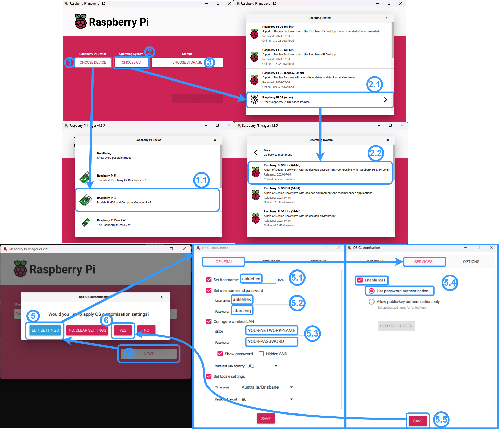

# README: Raspberry Pi Load Cell Project

## Project Overview
This project inital idea came from physiotherapists who wanted a way to visualise and measure the force exrted during ankle flexion and extension.

This project interfaces a Raspberry Pi with a HX711 load cell amplifier and a 5kg straight bar load cell (TAL220B) to measure weight. It also includes a button and an LED for interaction and indication purposes.


- [README: Raspberry Pi Load Cell Project](#readme-raspberry-pi-load-cell-project)
  - [Project Overview](#project-overview)
  - [Components Required](#components-required)
  - [Setup Process](#setup-process)
    - [Hardware Setup](#hardware-setup)
    - [Raspberry Pi set up](#raspberry-pi-set-up)
  - [Usage](#usage)


## Components Required

1. **Raspberry Pi** ([tested on model 4 B](https://au.mouser.com/ProductDetail/Raspberry-Pi/SC01939?qs=T%252BzbugeAwjieYVS2HrrK%2FQ%3D%3D&src=raspberrypi))
2. [**HX711 Load Cell Amplifier**](https://www.sparkfun.com/products/13879)
3. [**5kg Straight Bar Load Cell (TAL220B)**](https://www.sparkfun.com/products/14729)
4. **Push Button**
5. **LED**
6. **1k Ohm Resistor**
7. **Jumper Wires** (Female to Female)
8. **Breadboard or PCB for connections** (Optional)


## Setup Process

### Hardware Setup

| Wire | Load Cell | HX711 | Raspberry Pi | Button | 1K Ohms Resistor | LED |
|------|-----------|-------|--------------|--------|------------------|-----|
| 1    | Green (A+) | Green (A+) |              |        |                  |     |
| 2    | White (A-) | White (A-) |              |        |                  |     |
| 3    | Black (E-) | Black (E-) |              |        |                  |     |
| 4    | Red (E+)   | Red (E+)   |              |        |                  |     |
| 5    |            | VDD   | 5V Power     |        |                  |     |
| 6    |            | VCC   | 5V Power     |        |                  |     |
| 7    |            | DAT   | GPIO 2 (SDA) Pin 3 |        |                  |     |
| 8    |            | CLK   | GPIO 3 (SCL) Pin 5 |        |                  |     |
| 9    |            | GND   | GND          |        |                  |     |
| 10   |            |       | GPIO 17 Pin 11 | Leg 1  |                  |     |
| 11   |            |       | GND          | Leg 2  |                  |     |
| 12   |            |       |              |        | Leg 1            | Positive Pin |
| 13   |            |       | GPIO 26 Pin 37 |        | Leg 2            |     |
| 14   |            |       | GND          |        |                  | Negative pin |

<!-- include Doc/wiring_diagram.png -->
  


### Raspberry Pi set up
**Read the following instructions carefully before proceeding.**

First we need to flash the Raspberry Pi OS to a microSD card. We can use the [Raspberry Pi Imager](https://www.raspberrypi.com/software/). 

To set up a Raspberry Pi using Raspberry Pi Imager, start by clicking on `CHOOSE DEVICE` and selecting `Raspberry Pi 4`. 

Next, click on `CHOOSE OS`, select `Raspberry Pi OS (other)`, and then choose `Raspberry Pi OS Lite (64-bit)`. 

After that, click on `CHOOSE STORAGE` and select the desired storage device. Proceed by clicking `NEXT`. When prompted with, click on `EDIT SETTINGS`. In the customization settings, set the hostname and username to `ankleflex`,  and enter the password `starseng`. 

Configure the wireless LAN by entering your network's SSID and password.

<strong style="color:red">Note: </strong>if you use an iphone as a hotspot, you may need to change some settings to allow the Raspberry Pi to connect to the hotspot.

Save these settings by clicking `SAVE`. Finally, click `YES` to apply the customization settings.

The Raspberry Pi Imager will flash the OS to the microSD card. Once it is done, insert the microSD card into the Raspberry Pi and power it on.



Make sure the Raspberry Pi is connected to the same network as the computer you are using to ssh into it. 

Next open a terminal (on windows use shortcut `Win + R` and type `cmd` and press enter, on mac press `Cmd + Space` and type `terminal` and press enter, on linux press `Ctrl + Alt + T`) and ssh into the Raspberry Pi using the following command: 
```shell
ssh ankleflex@ankleFlex
```
enter the password: `starseng` when prompted.

Then run the following commands to update the Raspberry Pi and install the necessary software.
```shell
sudo apt update && sudo apt upgrade -y
sudo apt-get install git python3 python3-venv python3-pip -y
```

Clone the repository to the Raspberry Pi using the following command.
```shell
git clone https://github.com/SamiKaab/AnkleFlex
```
run the setup script:
```shell
cd AnkleFlex
chmod +x setup.sh
sudo ./setup.sh
```
The setup script will install the necessary libraries, set up the hotspot and set up the Raspberry Pi to run main.py on boot.
The Raspberry Pi will reboot after the setup script is done.

## Usage
Boot up the Raspberry Pi.The Raspberry Pi will create a hotspot called `AnkleFlex` with the password `starseng`.
Once the LED on the Raspberry Pi is solid, the Raspberry Pi is ready to be used.
Connect to the hotspot using the password and open a browser and navigate to `http://ankleflex:8050/` to access the web interface.

To Tare the device, press the button <strong style="color:red">once</strong>. 
If the program becomes unresponsive, press the button <strong style="color:red">twice</strong> within a second to restart device.